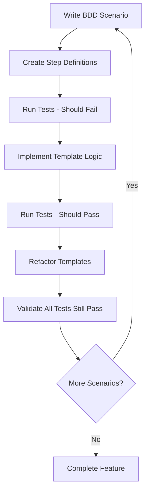
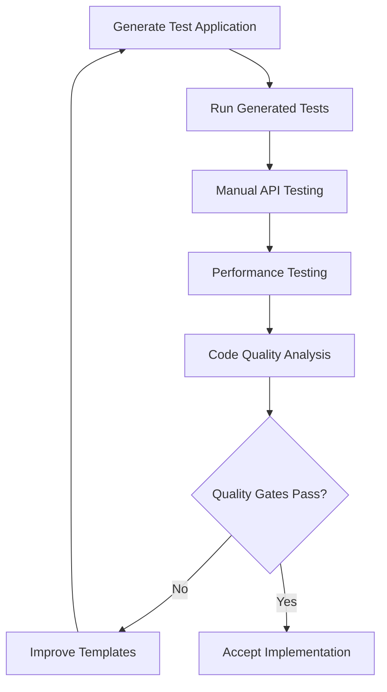

# BDD Workflow Patterns & Templates

## BDD Philosophy for Template Systems

### Behavior-Driven Template Development

The Python FastAPI SQLModel template system follows BDD principles at multiple levels:

- **Template Behavior**: How templates generate code with expected characteristics
- **Generated Code Behavior**: How generated applications behave for end users
- **Tool Behavior**: How code generation tools behave for developers
- **Integration Behavior**: How all components work together

### Multi-Level BDD Approach

#### Level 1: Template System BDD

Focus on the behavior of the template generation system itself.

```gherkin
Feature: Template Code Generation
  As a developer
  I want to generate backend applications from YAML configurations
  So that I can quickly create production-ready APIs

Scenario: Generate Domain from Simple Configuration
  Given I have a YAML configuration for a simple domain
  When I run the template generation tool
  Then it should create all hexagonal architecture layers
  And the generated code should follow established patterns
  And the generated application should run without errors
```

#### Level 2: Generated Application BDD

Focus on the behavior of applications created by the template system.

```gherkin
Feature: Generated CRUD Operations
  As an API user
  I want to perform standard operations on domain entities
  So that I can manage business data effectively

Scenario: Create New Entity
  Given the generated API is running
  When I POST valid entity data to the creation endpoint
  Then I should receive a 201 Created response
  And the entity should be stored in the database
  And I should be able to retrieve the entity by ID
```

#### Level 3: Code Quality BDD

Focus on the quality characteristics of generated code.

```gherkin
Feature: Generated Code Quality
  As a developer using generated code
  I want the output to follow best practices
  So that I can maintain and extend the code easily

Scenario: Generated Code Follows Architecture Patterns
  Given I generate any domain using the template
  When I analyze the code structure
  Then it should follow hexagonal architecture principles
  And each layer should have proper separation of concerns
  And dependencies should point toward the domain core
```

## BDD Workflow Implementation

### Red-Green-Refactor for Templates

#### Red Phase: Write Failing BDD Scenarios

1. **Define Template Behavior**: Write Gherkin scenarios for template generation
2. **Create Step Definitions**: Implement step definitions that will fail
3. **Verify Failure**: Confirm tests fail because functionality doesn't exist yet

#### Green Phase: Implement Template Logic

1. **Minimal Implementation**: Write just enough template code to make tests pass
2. **Focus on Behavior**: Ensure generated code exhibits expected behavior
3. **Validate Success**: Confirm all BDD scenarios pass

#### Refactor Phase: Improve Template Quality

1. **Code Quality**: Improve template organization and clarity
2. **Pattern Consistency**: Ensure all templates follow consistent patterns
3. **Performance**: Optimize template generation speed
4. **Maintainability**: Improve template readability and maintainability

### BDD Implementation Workflow

#### Template Development Workflow



#### Generated Code Validation Workflow



## BDD Scenario Templates

### Template System Scenarios

#### Basic Code Generation

```gherkin
Feature: Basic Domain Generation
  As a backend developer
  I want to generate complete domain implementations
  So that I can focus on business logic instead of boilerplate

Background:
  Given the template system is properly installed
  And I have a clean output directory

Scenario: Generate Simple Domain Entity
  Given I have a YAML configuration defining a "Product" domain
  And the configuration includes basic fields like name and description
  When I run the domain generation command
  Then it should create a domain entity file
  And the entity should include all configured fields
  And the entity should follow SQLModel patterns
  And the generated code should pass type checking

Scenario: Generate Complete Domain Stack
  Given I have a YAML configuration for a "User" domain
  When I run the domain generation command
  Then it should create all hexagonal architecture layers:
    | Layer          | Files Created                    |
    | Domain         | entity.py, models.py            |
    | Application    | use_case.py                     |
    | Infrastructure | repository.py                   |
    | Interface      | handler.py                      |
  And all generated files should be properly interconnected
  And the generated FastAPI application should start successfully

Scenario: Handle Invalid Configuration
  Given I have a YAML configuration with missing required fields
  When I run the domain generation command
  Then it should display clear error messages
  And it should not create any partial files
  And it should provide guidance on fixing the configuration
```

#### Advanced Template Features

```gherkin
Feature: Advanced Template Features
  As a developer working with complex domains
  I want advanced template capabilities
  So that I can model sophisticated business requirements

Scenario: Generate Domains with Relationships
  Given I have a YAML configuration defining:
    | Domain | Fields              | Relationships      |
    | User   | name, email         | has many Posts     |
    | Post   | title, content      | belongs to User    |
  When I run the domain generation command
  Then both domains should be generated with proper relationship models
  And the User model should include a posts relationship
  And the Post model should include a user_id foreign key
  And the generated API should support relationship operations

Scenario: Preserve Custom Code During Regeneration
  Given I have generated a "Product" domain
  And I have added custom business logic in preservation blocks:
    """
    # @pyhex:begin(custom_methods)
    def calculate_discounted_price(self, discount_percent: float) -> float:
        return self.price * (1 - discount_percent / 100)
    # @pyhex:end(custom_methods)
    """
  When I modify the YAML configuration to add a new field
  And I regenerate the domain
  Then the custom business logic should be preserved
  And the new field should be added to the entity
  And all tests should still pass

Scenario: Generate Complex Validation Rules
  Given I have a YAML configuration with validation rules:
    """
    fields:
      - name: email
        type: EmailStr
        validation:
          - unique: true
          - format: email
      - name: age
        type: int
        validation:
          - min: 0
          - max: 150
    """
  When I generate the domain
  Then the generated models should include proper validation
  And the API should reject invalid data with appropriate error messages
  And the validation rules should be tested in the generated test suite
```

### Generated Application Scenarios

#### API Functionality

```gherkin
Feature: Generated API Endpoints
  As an API consumer
  I want to interact with generated endpoints
  So that I can perform business operations

Background:
  Given a "Book" domain has been generated with fields:
    | Field       | Type   | Required |
    | title       | str    | true     |
    | author      | str    | true     |
    | isbn        | str    | false    |
    | price       | float  | true     |
  And the generated FastAPI application is running

Scenario: Create Book Successfully
  Given I have valid book data:
    """
    {
      "title": "The Python Guide",
      "author": "Jane Developer",
      "price": 29.99
    }
    """
  When I POST this data to "/books/"
  Then I should receive a 201 Created response
  And the response should include the created book with an ID
  And the book should be retrievable by its ID

Scenario: Validate Required Fields
  Given I have incomplete book data:
    """
    {
      "title": "Incomplete Book"
    }
    """
  When I POST this data to "/books/"
  Then I should receive a 422 Unprocessable Entity response
  And the response should clearly indicate which fields are missing
  And no book should be created in the database

Scenario: Update Book Information
  Given a book exists with ID 1
  When I PUT updated data to "/books/1":
    """
    {
      "title": "The Updated Python Guide",
      "author": "Jane Developer",
      "price": 34.99
    }
    """
  Then I should receive a 200 OK response
  And the book should be updated in the database
  And I should be able to retrieve the updated information

Scenario: Delete Book
  Given a book exists with ID 1
  When I DELETE "/books/1"
  Then I should receive a 204 No Content response
  And the book should no longer exist in the database
  And subsequent GET requests should return 404

Scenario: List Books with Pagination
  Given 25 books exist in the database
  When I GET "/books/?skip=10&limit=5"
  Then I should receive a 200 OK response
  And the response should contain exactly 5 books
  And the books should be the correct subset (items 11-15)
```

#### Database Integration

```gherkin
Feature: Generated Database Integration
  As a developer
  I want generated code to work correctly with the database
  So that data is persisted and retrieved accurately

Background:
  Given the database is properly configured
  And migrations have been applied

Scenario: Entity Persistence
  Given I create a new entity through the API
  When I restart the application
  Then the entity should still exist in the database
  And all field values should be preserved correctly

Scenario: Relationship Integrity
  Given I have User and Post entities with a one-to-many relationship
  When I create a post associated with a user
  Then the relationship should be properly stored
  And I should be able to query posts by user
  And deleting a user should handle related posts appropriately

Scenario: Database Constraints
  Given the entity has unique constraints on certain fields
  When I try to create entities with duplicate values
  Then the database should enforce the constraint
  And the API should return appropriate error responses
```

## BDD Testing Infrastructure

### Step Definition Patterns

#### Template Generation Steps

```python
# Step definitions for template generation testing
from behave import given, when, then
import tempfile
import shutil
from pathlib import Path
import yaml

from cmd.generate.main import DomainGenerator

@given('I have a YAML configuration for a "{domain}" domain')
def step_given_yaml_config(context, domain):
    """Set up a basic YAML configuration for testing"""
    context.domain = domain.lower()
    context.config = {
        'domain': {
            'name': domain,
            'plural': f"{domain}s"
        },
        'entities': [{
            'name': domain,
            'fields': [
                {'name': 'name', 'type': 'str', 'required': True},
                {'name': 'description', 'type': 'Optional[str]', 'required': False}
            ]
        }],
        'endpoints': [
            {'method': 'POST', 'path': '/', 'operation': 'create'},
            {'method': 'GET', 'path': '/{id}', 'operation': 'get_by_id'},
            {'method': 'GET', 'path': '/', 'operation': 'list'},
            {'method': 'PUT', 'path': '/{id}', 'operation': 'update'},
            {'method': 'DELETE', 'path': '/{id}', 'operation': 'delete'}
        ]
    }

@given('the configuration includes {field_description}')
def step_given_config_includes(context, field_description):
    """Add specific configuration details"""
    # Parse field_description and modify context.config
    pass

@when('I run the domain generation command')
def step_when_run_generation(context):
    """Execute the domain generation process"""
    context.output_dir = tempfile.mkdtemp()
    context.generator = DomainGenerator(output_dir=context.output_dir)
    
    try:
        context.generation_result = context.generator.generate(context.config)
        context.generation_success = True
    except Exception as e:
        context.generation_error = e
        context.generation_success = False

@then('it should create a domain entity file')
def step_then_creates_entity_file(context):
    """Verify entity file is created"""
    entity_file = Path(context.output_dir) / "src" / "domain" / context.domain / "entity.py"
    assert entity_file.exists(), f"Entity file not created: {entity_file}"

@then('the entity should include all configured fields')
def step_then_entity_includes_fields(context):
    """Verify entity contains expected fields"""
    entity_file = Path(context.output_dir) / "src" / "domain" / context.domain / "entity.py"
    entity_content = entity_file.read_text()
    
    for entity in context.config['entities']:
        for field in entity['fields']:
            assert field['name'] in entity_content, f"Field {field['name']} not found in entity"

@then('the generated code should pass type checking')
def step_then_code_passes_type_checking(context):
    """Verify generated code passes mypy"""
    import subprocess
    import os
    
    os.chdir(context.output_dir)
    result = subprocess.run(['mypy', 'src/'], capture_output=True, text=True)
    assert result.returncode == 0, f"Type checking failed: {result.stdout}\n{result.stderr}"
```

#### API Testing Steps

```python
# Step definitions for generated API testing
from behave import given, when, then
import json
import httpx

@given('the generated FastAPI application is running')
def step_given_api_running(context):
    """Ensure the API is running and accessible"""
    context.client = httpx.Client(base_url="http://localhost:8000")
    # Verify the API is responsive
    response = context.client.get("/health")
    assert response.status_code == 200

@given('I have valid {entity} data')
def step_given_valid_data(context, entity):
    """Set up valid entity data from docstring"""
    context.entity_data = json.loads(context.text)

@when('I POST this data to "{endpoint}"')
def step_when_post_data(context, endpoint):
    """Make POST request with entity data"""
    context.response = context.client.post(endpoint, json=context.entity_data)

@then('I should receive a {status_code:d} {status_text} response')
def step_then_receive_status(context, status_code, status_text):
    """Verify response status code"""
    assert context.response.status_code == status_code, \
        f"Expected {status_code}, got {context.response.status_code}: {context.response.text}"

@then('the response should include the created {entity} with an ID')
def step_then_response_includes_entity_with_id(context, entity):
    """Verify response contains entity with ID"""
    response_data = context.response.json()
    assert 'id' in response_data, "Response should include an ID"
    assert response_data['id'] is not None, "ID should not be null"
    
    # Store the created entity for future steps
    context.created_entity = response_data
```

### Test Data Management

#### Configuration Fixtures

```python
# Test configuration management
class ConfigurationFixtures:
    """Manage test YAML configurations"""
    
    @staticmethod
    def simple_domain(domain_name: str) -> dict:
        """Basic domain configuration for testing"""
        return {
            'domain': {
                'name': domain_name,
                'plural': f"{domain_name}s"
            },
            'entities': [{
                'name': domain_name,
                'fields': [
                    {'name': 'name', 'type': 'str', 'required': True, 'index': True},
                    {'name': 'description', 'type': 'Optional[str]', 'required': False},
                    {'name': 'created_at', 'type': 'datetime', 'default': 'datetime.utcnow'},
                    {'name': 'updated_at', 'type': 'datetime', 'default': 'datetime.utcnow'}
                ]
            }]
        }
    
    @staticmethod
    def domain_with_relationships() -> dict:
        """Configuration with entity relationships"""
        return {
            'domain': {
                'name': 'Blog',
                'entities': ['User', 'Post']
            },
            'entities': [
                {
                    'name': 'User',
                    'fields': [
                        {'name': 'name', 'type': 'str', 'required': True},
                        {'name': 'email', 'type': 'EmailStr', 'required': True, 'unique': True}
                    ],
                    'relationships': [
                        {'entity': 'Post', 'type': 'one_to_many', 'back_populates': 'user'}
                    ]
                },
                {
                    'name': 'Post',
                    'fields': [
                        {'name': 'title', 'type': 'str', 'required': True},
                        {'name': 'content', 'type': 'str', 'required': True},
                        {'name': 'user_id', 'type': 'int', 'foreign_key': 'user.id'}
                    ],
                    'relationships': [
                        {'entity': 'User', 'type': 'many_to_one', 'back_populates': 'posts'}
                    ]
                }
            ]
        }
```

#### Test Environment Setup

```python
# Environment setup for BDD testing
class TestEnvironment:
    """Manage test environment setup and teardown"""
    
    def __init__(self):
        self.temp_dirs = []
        self.generated_apps = []
    
    def create_temp_workspace(self) -> Path:
        """Create temporary workspace for testing"""
        temp_dir = tempfile.mkdtemp(prefix="template_test_")
        self.temp_dirs.append(temp_dir)
        return Path(temp_dir)
    
    def generate_test_app(self, config: dict, workspace: Path) -> Path:
        """Generate a test application in the workspace"""
        generator = DomainGenerator(output_dir=workspace)
        generator.generate(config)
        self.generated_apps.append(workspace)
        return workspace
    
    def cleanup(self):
        """Clean up all temporary resources"""
        for temp_dir in self.temp_dirs:
            shutil.rmtree(temp_dir, ignore_errors=True)
        self.temp_dirs.clear()
        self.generated_apps.clear()
```

## BDD Integration with Development Workflow

### Development Cycle Integration

1. **Feature Planning**: Write BDD scenarios before implementation
2. **Template Development**: Implement templates to satisfy scenarios
3. **Generated Code Testing**: Validate generated applications meet scenarios
4. **Refactoring**: Improve templates while maintaining scenario compliance

### Continuous Integration

```yaml
# BDD testing in CI pipeline
name: BDD Template Testing

on: [push, pull_request]

jobs:
  bdd-template-tests:
    runs-on: ubuntu-latest
    steps:
      - uses: actions/checkout@v3
      
      - name: Set up Python
        uses: actions/setup-python@v4
        with:
          python-version: '3.11'
      
      - name: Install dependencies
        run: |
          pip install -e .[dev,generation]
          pip install behave
      
      - name: Run BDD template tests
        run: |
          behave tests/bdd/template_features/
      
      - name: Generate test applications
        run: |
          behave tests/bdd/generated_app_features/
      
      - name: Test generated applications
        run: |
          behave tests/bdd/api_features/
```

### Quality Gates

- **Template BDD Compliance**: All template scenarios must pass
- **Generated Code BDD Compliance**: Generated applications must pass their scenarios
- **Performance Scenarios**: Generation and runtime performance scenarios must pass
- **Integration Scenarios**: End-to-end integration scenarios must pass

This BDD workflow ensures that the template system reliably produces high-quality, well-tested applications that meet
user expectations and business requirements.